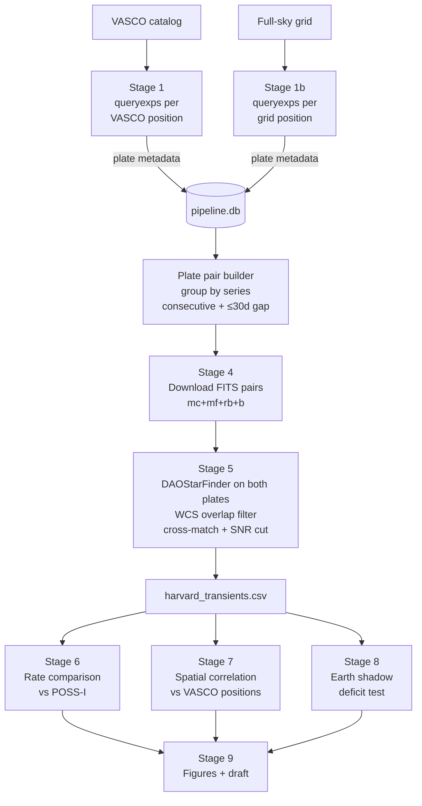
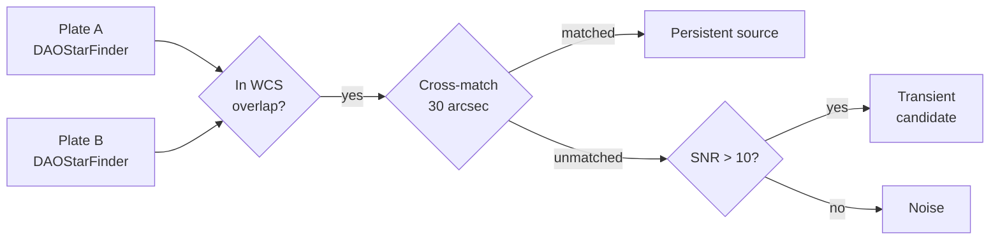
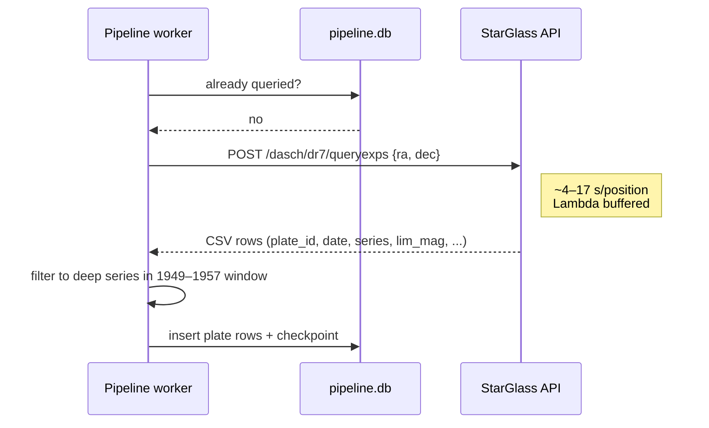

# VASCO × DASCH Cross-Match Pipeline

An independent test of the VASCO transient claims using Harvard's DASCH DR7
plate archive to build an independent transient catalog via consecutive
plate-pair differencing.

## Background and motivation

In 2025, Bruehl & Villarroel published a catalog of **107,875 transient sources**
detected on Palomar Sky Survey plates from **1949–1957** — brief flashes that
appear on a single plate and never again, all pre-dating the launch of Sputnik
in October 1957. The VASCO group reported two striking statistical signatures:

- A **22σ deficit** of transients inside Earth's umbral shadow, consistent with
  reflective objects in geosynchronous orbit before any human-made satellite
  could plausibly exist there.
- A **45% increase** in transient rate within 24 hours of atmospheric nuclear tests.

The claims are contested. Watters et al. (2026) argued the signals are explained
by plate defects and observation-schedule artifacts; Villarroel rebutted in
February 2026. Independent replications by Doherty (April 2026) and Busko (March
2026, using Hamburg plates via APPLAUSE) recovered both signatures on different
data, but **no one has yet cross-matched VASCO against Harvard's DASCH archive**
— the largest digitized photographic plate collection in the world (430,000+
plates, 1885–1992), made fully public in December 2024.

That's the gap this project fills. Whatever the result — confirmation,
constraint, or refutation — it is publishable, because it is the first
cross-instrument check of VASCO using a fully independent telescope archive.

## Approach

We detect transients the same way POSS-I did: **compare consecutive exposures
from the same detector**. A source present on plate A but absent on plate B
(same telescope series, taken within 30 days) is a transient candidate. This
produces an independent Harvard transient catalog that we compare to VASCO
statistically.

We explicitly are **not** trying to catch the same flash on a Harvard plate
(probability ~0% given exposure timing). The science questions are:

1. Do Harvard plates show a comparable transient rate to POSS-I?
2. Is the Earth-shadow deficit reproduced in DASCH detections?
3. Do Harvard transients cluster spatially near VASCO positions?
4. Does the nuclear-test temporal correlation hold on a second telescope?

## Data pipeline



### Transient detection method



Sources are only compared within the **WCS footprint overlap** of both plates,
eliminating false transients from plate-edge effects. The SNR cut ensures that
bright sources (which should appear on both plates of similar depth) are the
only candidates — faint threshold detections are discarded.

### Stage interactions with the DASCH API



Two worker threads query in parallel with batched futures (≤4 in flight at a
time) to avoid OOM. Checkpoints land every 100 queries.

## Why these telescopes?

DASCH contains plates from dozens of instruments spanning a century, but only a
handful are useful for this project. The filter is driven by a single
requirement: **depth must reach VASCO transient brightness**.

VASCO sources sit at photographic magnitude ~15–16. A plate whose limiting
magnitude is mag 12 cannot detect a VASCO-brightness transient even in
principle, no matter how many positions it covers. We measured the median
`limMagApass` directly from DASCH metadata for every series with plates in the
1949–1957 window:

| Series | Median lim mag | VASCO detectable? | Window plates (52-pos sample) |
|--------|---------------:|-------------------|------------------------------:|
| `mc` (Metcalf)  | 17.0 | **Yes — best**    |    233 |
| `mf`            | 16.4 | **Yes**           |    389 |
| `rb`            | 15.8 | **Marginal**      |    585 |
| `b` (Bache)     | 15.3 | **Marginal**      |    325 |
| `rh`            | 15.0 | Barely            |  1,772 |
| `ac`            | 14.1 | No                |  7,419 |
| `ai`/`fa`/`ka`  | 11.9–12.1 | No           | ~33,000 each |

The patrol-camera series (`ai`, `fa`, `ka`) dominate the plate count by an order
of magnitude, but their 1.5-inch apertures and short exposures bottom out around
mag 12. They are only useful as a comparison baseline for *brighter* transient
rates — not for detecting VASCO-depth flashes.

So Stage 4 filters to `mc`, `mf`, `rb`, `b`. This keeps every plate that *could*
detect a VASCO transient and discards plates that *couldn't*, regardless of how
numerous they are.

## Consecutive plate pairs

Transient detection requires comparing two plates of the same field. We build
pairs by:

1. Grouping all deep-series window plates by telescope series
2. Sorting each group by observation date
3. Pairing consecutive plates (plate N with plate N+1)
4. Filtering to pairs with ≤30 day gap

The 30-day gap filter keeps 64% of all possible consecutive pairs while
excluding multi-month gaps where variable stars would contaminate the sample.
41% of pairs are same-night or next-day, closest to POSS-I's method.

## Full-sky coverage

The VASCO catalog only covers Dec > -3.3° (northern sky). To avoid biasing the
Harvard transient sample, we also query a full-sky grid at 5° spacing (Stage 1b),
covering Dec -85° to +85°. This picks up deep-series plates in the southern
hemisphere — particularly `mf` and `rb` series, which have strong southern
coverage.

## Repository layout

```
vasco-dasch/
├── config.yaml                  # API config, paths, parameters
├── pyproject.toml               # poetry-managed dependencies
├── run_pipeline.sh              # master script, runs stages 0–1
├── data/
│   ├── vasco_catalog/           # input catalogs
│   ├── pipeline.db              # SQLite: plates, transients, results
│   ├── fits_cutouts/            # downloaded plate pair images
│   └── results/                 # analysis outputs, figures
├── src/
│   ├── 00_fetch_vasco_catalog.py
│   ├── 01_query_plate_coverage.py     # Stage 1, parallelized
│   ├── 01b_query_full_sky.py          # full-sky grid inventory
│   ├── 04_download_fits.py            # download plate pairs
│   ├── 05_source_extraction.py        # plate-pair differencing
│   ├── 06_rate_comparison.py          # Harvard vs POSS-I rate
│   ├── 07_spatial_correlation.py      # Harvard ↔ VASCO clustering
│   ├── 08_shadow_analysis.py          # Earth shadow deficit
│   ├── 09_generate_figures.py
│   └── utils/
│       ├── dasch_api.py               # API wrapper
│       ├── plate_pairs.py             # consecutive pair builder
│       ├── database.py                # SQLite storage layer
│       └── statistics.py              # statistical test functions
└── tests/
```

## Running the pipeline

```bash
poetry install                                          # first time only

# Plate inventory (already complete for vetted set)
./run_pipeline.sh --catalog vetted                      # stages 0–1
poetry run python src/01b_query_full_sky.py             # full-sky grid

# Transient detection and analysis
poetry run python src/04_download_fits.py               # download plate pairs
poetry run python src/05_source_extraction.py           # detect transients
poetry run python src/06_rate_comparison.py             # rate test
poetry run python src/07_spatial_correlation.py         # clustering test
poetry run python src/08_shadow_analysis.py             # shadow deficit
poetry run python src/09_generate_figures.py
```

All long-running stages are resumable — re-running skips already-completed work.

## References

- Bruehl & Villarroel (2025), *Sci. Rep.*, [10.1038/s41598-025-21620-3](https://doi.org/10.1038/s41598-025-21620-3)
- Solano et al. (2022), *MNRAS* 515, 1380 — vetted 5,399 subset
- Watters et al. (2026) — critique
- Villarroel (Feb 2026), arXiv:2602.15171 — rebuttal
- DASCH DR7: https://dasch.cfa.harvard.edu/dr7/
- StarGlass: https://starglass.cfa.harvard.edu
