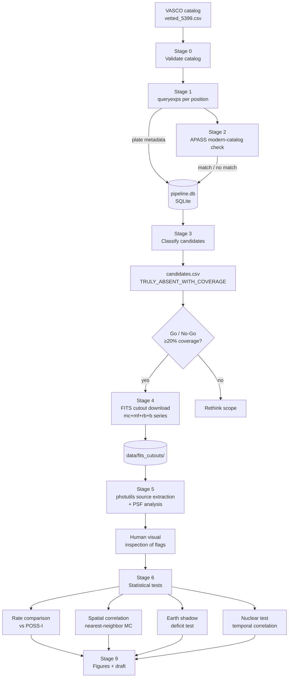
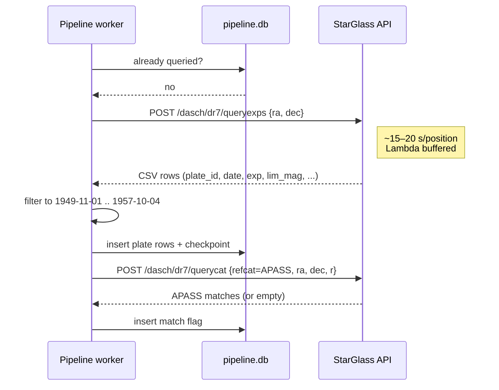
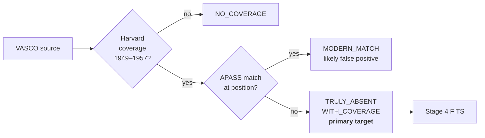

# VASCO × DASCH Cross-Match Pipeline

An independent test of the VASCO transient claims, cross-matching the published
catalog of pre-Sputnik flashes against Harvard's DASCH DR7 plate archive.

## Background and motivation

In 2025, Bruehl & Villarroel published a catalog of **107,875 transient sources**
detected on Palomar Sky Survey plates from **1949–1957** — brief flashes that
appear on a single plate and never again, all pre-dating the launch of Sputnik
in October 1957. The VASCO group reported two striking statistical signatures:

- A **22σ deficit** of transients inside Earth's umbral shadow, consistent with
  reflective objects in geosynchronous orbit before any human-made satellite
  could plausibly exist there.
- A **45% increase** in transient rate within 24 hours of atmospheric nuclear tests.

The claims are contested. Watters et al. (2026) argued the signals are explained
by plate defects and observation-schedule artifacts; Villarroel rebutted in
February 2026. Independent replications by Doherty (April 2026) and Busko (March
2026, using Hamburg plates via APPLAUSE) recovered both signatures on different
data, but **no one has yet cross-matched VASCO against Harvard's DASCH archive**
— the largest digitized photographic plate collection in the world (430,000+
plates, 1885–1992), made fully public in December 2024.

That's the gap this project fills. Whatever the result — confirmation,
constraint, or refutation — it is publishable, because it is the first
cross-instrument check of VASCO using a fully independent telescope archive.

We explicitly are **not** trying to catch the same flash on a Harvard plate
(probability ~0% given exposure timing). The science questions are statistical:

1. Do Harvard plates show a comparable transient rate at VASCO positions?
2. Is the Earth-shadow deficit reproduced in DASCH detections?
3. Does the nuclear-test temporal correlation hold up on a second telescope?
4. Do VASCO positions cluster spatially in a way consistent with reflective
   objects, or is the distribution consistent with noise?

## Approach

For each VASCO source, ask DASCH: *what plates from 1949–1957 cover this sky
position, and is anything detected there?* Sources with Harvard coverage but
no modern (APASS) catalog match at that location are the primary candidates —
they represent positions that were genuinely empty in modern data, so any
detection on a 1949–1957 Harvard plate is interesting.

The pipeline is built around the DASCH StarGlass API
(`api.starglass.cfa.harvard.edu/full`), with checkpointed SQLite storage and
resumable stages so multi-day runs can be interrupted safely.

## Data pipeline



### Stage interactions with the DASCH API



Four worker threads run `queryexps` in parallel; the API response time (not
our 0.5 req/s rate limit) is the bottleneck, so concurrency gives a clean ~4x
speedup. Checkpoints land every 100 queries so a crash loses at most a minute
of work.

### Candidate classification



## Repository layout

```
vasco-dasch/
├── config.yaml                  # API config, paths, parameters
├── pyproject.toml               # poetry-managed dependencies
├── run_pipeline.sh              # master script, runs stages 0–3
├── data/
│   ├── vasco_catalog/           # input catalogs
│   ├── pipeline.db              # SQLite: plates, matches, candidates
│   ├── fits_cutouts/            # downloaded plate images
│   └── results/                 # candidate lists, figures
├── src/
│   ├── 00_fetch_vasco_catalog.py
│   ├── 01_query_plate_coverage.py     # Stage 1, parallelized
│   ├── 02_retrieve_lightcurves.py     # APASS check
│   ├── 03_filter_candidates.py
│   ├── 04_download_fits.py
│   ├── 05_source_extraction.py        # photutils + PSF
│   ├── 06_rate_comparison.py
│   ├── 07_spatial_correlation.py
│   ├── 08_shadow_analysis.py
│   ├── 09_generate_figures.py
│   └── utils/                          # API client, coords, db, stats
└── tests/
```

## Running the pipeline

```bash
poetry install                                  # first time only
poetry run python tests/test_api_connection.py  # smoke test

./run_pipeline.sh --catalog vetted              # stages 0–3, overnight
# review candidates, then:
poetry run python src/04_download_fits.py --limit 50
poetry run python src/05_source_extraction.py
poetry run python src/06_rate_comparison.py
poetry run python src/09_generate_figures.py
```

All long-running stages are resumable: re-running `run_pipeline.sh` skips
positions already in `pipeline.db`. Sources at `|Dec| > 88°` are auto-excluded
because the API times out at the poles.

## Why these telescopes?

DASCH contains plates from dozens of instruments spanning a century, but only a
handful are useful for this project. The filter is driven by a single
requirement: **depth must reach VASCO transient brightness**.

VASCO sources sit at photographic magnitude ~15–16. A plate whose limiting
magnitude is mag 12 cannot detect a VASCO-brightness transient even in
principle, no matter how many positions it covers. We measured the median
`limMagApass` directly from DASCH metadata for every series with plates in the
1949–1957 window:

| Series | Median lim mag | VASCO detectable? | Window plates (52-pos sample) |
|--------|---------------:|-------------------|------------------------------:|
| `mc` (Metcalf)  | 17.0 | **Yes — best**    |    233 |
| `mf`            | 16.4 | **Yes**           |    389 |
| `rb`            | 15.8 | **Marginal**      |    585 |
| `b` (Bache)     | 15.3 | **Marginal**      |    325 |
| `rh`            | 15.0 | Barely            |  1,772 |
| `ac`            | 14.1 | No                |  7,419 |
| `ai`/`fa`/`ka`  | 11.9–12.1 | No           | ~33,000 each |

The patrol-camera series (`ai`, `fa`, `ka`) dominate the plate count by an order
of magnitude, but their 1.5-inch apertures and short exposures bottom out around
mag 12. They are only useful as a comparison baseline for *brighter* transient
rates — not for detecting VASCO-depth flashes.

So Stage 4 filters to `mc`, `mf`, `rb`, `b`. This keeps every plate that *could*
detect a VASCO transient and discards plates that *couldn't*, regardless of how
numerous they are.

**Note on the Bache (`b`) series.** A Night-1 hand-analysis of the
nine-transient field initially highlighted the 8-inch Bache Doublet as the
closest analogue to Palomar's 48-inch Schmidt. That intuition turned out to be
only partly right: the b-series peaked in 1885–1920 and had wound down to ~308
plates in the 1950s, so it contributes far less coverage in the VASCO window
than `mc` or `mf`. We keep it in the filter because its depth (mag 15.3) is
still in range, but `mc` and `mf` are the workhorses.

## Status

Stage 1 is currently running on the vetted 5,399-source catalog with 4 parallel
workers; ETA ~5 hours. The full 107,875-source catalog is not publicly available
and must be requested from the authors.

## References

- Bruehl & Villarroel (2025), *Sci. Rep.*, [10.1038/s41598-025-21620-3](https://doi.org/10.1038/s41598-025-21620-3)
- Solano et al. (2022), *MNRAS* 515, 1380 — vetted 5,399 subset
- Watters et al. (2026) — critique
- Villarroel (Feb 2026), arXiv:2602.15171 — rebuttal
- DASCH DR7: https://dasch.cfa.harvard.edu/dr7/
- StarGlass: https://starglass.cfa.harvard.edu
